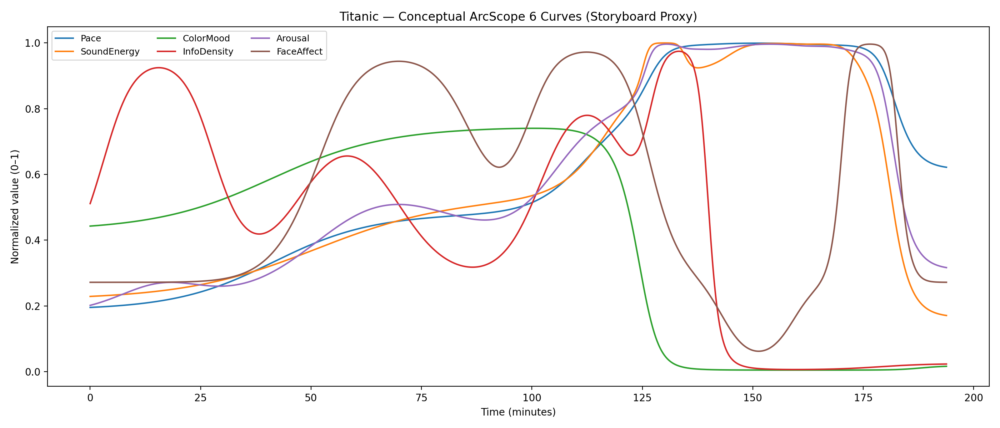

# ArcScope

**A local macOS app for film structure analysis**

ArcScope doesn't tell you whether a film is "good" or "bad" — it deconstructs *why* people disagree about the same film into checkable, alignable structure.

---

## What ArcScope Does

ArcScope treats film as **a system of interacting signals** rather than a single opinion.

It does not score taste; it **locates disagreement**.

By separating observation from diagnosis, it gives creators a shared language to argue about structure—so **"I feel" becomes a starting point for analysis, not the end of discussion**.

---

## The Problem It Solves

When two people disagree about the same scene, they often can't even articulate *what* they're arguing about:

- One says "this is too fast"
- One says "there's too much information"
- One says "my emotion got interrupted"
- One says "I didn't understand the character's motivation"

These are all subjective judgments, but the problem isn't subjectivity — **it's that they point to different dimensions, yet get lumped into the same "I feel it's wrong"**.

👉 **ArcScope's goal**: Break out the structural variables behind subjective judgments, so disagreements can be *located*, not just *argued*.

---

## How It Works (Three Layers)

### Layer 1: Observe, Don't Interpret (SecondObs)

Transform a film into a set of time-varying "observation curves":

- Cut density
- Motion intensity
- Audio energy (RMS / transients)
- Color state (brightness / saturation / warmth / hue)
- Subtitle information (words/sec, exposition)
- Face presence (from tracking, not emotion judgment)

**Key**: No "how does the audience feel" — only: **What happened in this second?**

### Layer 2: Structure Is Relationship, Not Opinion (FilmEngine)

FilmEngine understands relationships between variables, not people:

- Info density ↑, but emotional arousal ↓
- Pace ↑, but narrative input ≈ 0
- Emotion stays high long-term, no recovery zone
- Multiple dimensions phase-conflict at the same time

These aren't "good/bad" — they're: **Is the structure self-consistent?**

ArcScope detects:
- **Structural overload**
- **Tension mismatch**
- **Long-term unresolved tension**
- **Narrative input vs. sensory stimulus desync**

👉 It's not a judge; it's a diagnostic instrument.

### Layer 3: Ground Arguments in Language

When you argue, ArcScope lets you say:

❌ "I feel this section is chaotic"
✅ "Info density + cut density are both at 95th percentile, but emotion curve is flat"

❌ "The audience won't understand"
✅ "Exposition peaks for 40 consecutive seconds, but visual load doesn't drop"

Turn "feelings" into "identifiable locations".

---

## Core Philosophy

**ArcScope doesn't deny subjectivity — it refuses *unlocated* subjectivity.**

It does three things:

1️⃣ **Decompose "feelings" into orthogonal dimensions**
You can like one aspect and dislike another, but at least you know *what* you're reacting to.

2️⃣ **Pull disagreements from "personality layer" back to "structural layer"**
Arguments shift from "do you understand film?" to "are we attending to different structural signals?"

3️⃣ **Acknowledge: No single right answer, but there is incoherence**
ArcScope doesn't say "this section definitely doesn't work" — it says "if your goal is X, this structure creates systemic resistance to X".

---

## Primary Use Cases

- **Post-production review** - Locate specific problem segments during editing/mixing
- **Structural analysis of classics** - See how masters handle tension and pacing
- **Shared language for team discussion** - Replace "I feel" with structural data
- **Second viewing analysis** - Find the exact location of "something feels off"

---

## Technical Features

- ✅ **Fully local execution** (no cloud dependency, avoids copyright/privacy issues)
- ✅ **Unified timeline** (1Hz sampling, all curves can be overlaid)
- ✅ **Parameter-free adaptation** (PCA auto-weighting, robust statistics)
- ✅ **Multimodal synthesis** (pace, sound, color, info, performance)
- ✅ **Automatic diagnostics** (marks structural conflict zones)
- ✅ **Reference comparison** (overlay other films' curves for structural contrast)

> Detailed design docs: `Arcscope.docx` / `arcscope.md` / `ArcScope_CoreContract.md`

---

## Core Capabilities

### 6 Structural Curves (Unified Timeline)

- **Pace(t)** - Rhythm: cutting + motion
- **Sound(t)** - Audio energy/pressure
- **Color(t)** - Color emotion/visual temperature
- **Info(t)** - Information density (verbal/visual/event load)
- **Face(t)** - Performance presence × expression intensity (optional)
- **Arousal(t)** - Composite arousal

### Automatic Diagnostics

- **LowActivity** - Lethargic pacing segments
- **OvercutFlat** - High cut density but no emotion
- **AudioVisualMisalign** - Picture and sound in conflict
- **InfoKillsEmotion** - Excessive dialogue suppressing emotion
- **HighTensionLowPace** - Visual tension but slow rhythm
- ...and 13 structural conflict patterns total

### Structural Segmentation

`Shot → Scene → Sequence → Act` - Four hierarchical levels auto-detected

### Film Library Management

- Local SQLite persistence
- Reference library: overlay ghost curves from other films for comparison
- Export: poster (PNG/PDF) and analysis reports

---

## Case Study: Reading Structural Curves

### Example: Titanic — Temporal Decomposition of a Classic Three-Act Structure



**Titanic (conceptual demo / storyboard proxy).** Six normalized structural curves (0–1): Pace (blue), SoundEnergy (orange), ColorMood (green), InfoDensity (red), Arousal (purple), FaceAffect (brown).

> **Note**: This figure illustrates the expected *shape* of the curves based on structural analysis and is a conceptual representation, not extracted from raw film data yet. The patterns shown are consistent with the film's known narrative architecture.

The horizontal axis is runtime (minutes), vertical axis is 0–1 normalized intensity. This chart reveals how Titanic orchestrates a classic structural transformation: first half builds world and relationships → 120–140 min structural rupture → second half enters high-arousal disaster mode → near-ending returns to emotional anchor.

**What makes this useful: not "good" or "bad", but *where the structure shifts gears*.**

---

#### **Timeline Breakdown: How Six Dimensions Tell the Story**

**0–30 min: Information Modeling Period (InfoDensity Peak)**

- **InfoDensity (red)** surges around 10–25 min, reaching 0.9+: The film is establishing rules, class hierarchy, character positions, and narrative framework.
- **Pace / Sound / Arousal** all stay low (0.2–0.3): Audience is *understanding the world*, not being chased.
- **ColorMood (green)** starts around 0.45 (neutral-cool): Ship interiors, social formality, not yet warm/intimate.

**👉 Diagnostic implication:**
This is what many viewers call "the slow opening" — it's **Info-driven, not emotion-driven**. ArcScope would mark this as high cognitive load but low sensory pressure.

---

**30–90 min: Emotional & Intimacy Building (FaceAffect Rises, ColorMood Warms)**

- **FaceAffect (brown)** climbs from ~0.3 to 0.95 between 50–85 min: Intimate relationship establishment, emotional close-ups dominate.
- **ColorMood (green)** slowly rises from 0.5 to 0.72: Visual tone shifts warmer/softer/romantic (golden light, warm interiors).
- **InfoDensity** drops significantly (0.9 → 0.3): Film lets audience *immerse* rather than *parse*.
- **Pace/Sound/Arousal** gradually build but stay moderate (0.3–0.5): Gentle escalation without pressure.

**👉 Diagnostic implication:**
This is the "romance film weight" core: **Face + Color are driving the experience**. If you edit this section to reduce Face time or cool the color palette, you're not "improving pacing" — you're **changing the genre contract**.

---

**90–125 min: Pressure Accumulation Before Disaster (Arousal Starts Climbing)**

- **Arousal (purple)** begins upward trajectory from 0.45 to 0.75: Audience senses "something is coming".
- **Pace (blue) / Sound (orange)** also lift from 0.45 to 0.8: Visual rhythm and audio energy increase.
- **InfoDensity** has a secondary peak around 100–115 min (0.75): Warnings, constraints, procedural rules reappear.
- **FaceAffect** remains high but plateaus around 0.95: Emotional investment is locked in.

**👉 Diagnostic implication:**
This is the **"romance → systemic pressure" transition zone**. Structure is shifting from intimate character focus to procedural/mechanical tension. ArcScope would note: *Info resurgence while Face sustains high*.

---

**125–145 min: Structural Rupture Point (All Curves Converge or Diverge Sharply)**

**This is the most critical "ArcScope moment" in the entire film:**

- **Pace / SoundEnergy / Arousal** all spike to near 1.0 and form a **high plateau**: Disaster mode fully engaged — rhythm, audio pressure, and tension completely take over.

- **ColorMood (green)** experiences a **cliff-edge drop** from 0.72 to near 0.02 around 125–135 min: Visual language switches from warm/romantic to cold/metallic/night/ocean — a total tonal rupture.

- **InfoDensity** surges briefly to 0.9+ around 130–140 min, then **collapses to near 0** after 145 min:
  - **Phase 1 (130–140)**: Dense instructions, commands, rules, procedural dialogue ("lifeboats on deck", "women and children first", etc.)
  - **Phase 2 (145+)**: Info drops because the film enters **pure action/survival mode** — less verbal explanation, more visual chaos.

- **FaceAffect** crashes to its lowest point around 150 min (~0.08): Large-scale disaster shots dominate; stable intimate close-ups are replaced by crowd panic and wide environmental shots.

**👉 Diagnostic implications:**

- **ColorMoodRupture**: Complete visual regime change — not gradual, but structural.
- **InfoSaturation → InfoCollapse**: Brief overload of procedural rules, then total abandonment.
- **ArousalSaturation**: Pace/Sound/Arousal locked at ceiling = sustained high pressure.
- **Face-vs-System Tension**: FaceAffect squeezed out by system-scale visuals.

**This is not "good" or "bad" — it's a *structural gear shift*:**
- Some viewers: "Finally, the real story / intense / overwhelming"
- Other viewers: "Emotional continuity broken / too procedural / lost the characters"

**Both reactions are structurally grounded — they're responding to different dimensions.**

---

**145–165 min: High Arousal Plateau (Disaster Sequence)**

- **Pace / Sound / Arousal** maintain near-maximum levels (~0.98–1.0): Sustained pressure with no recovery zones.
- **InfoDensity** stays near 0: More visual/kinetic storytelling than verbal.
- **FaceAffect** remains suppressed (~0.1): Wide shots, crowd chaos, mechanical destruction dominate.
- **ColorMood** stays near 0: Cold, dark, hostile visual environment persists.

**👉 Diagnostic implication:**
ArcScope would flag this as **ArousalSaturation** or **ExtendedHighLoad** — prolonged high-intensity without modulation. This is where some viewers experience fatigue or numbness, while others are fully engaged.

---

**165–185 min: Emotional Reclamation (FaceAffect Returns to Peak)**

- **FaceAffect (brown)** suddenly surges from 0.1 to near 1.0 around 175–182 min: Return to intimate close-ups — the "separation/promise/goodbye" emotional climax.

- **Pace / Sound / Arousal** begin descending from ceiling (1.0 → 0.6–0.4): Transition from "survival" to "endurance/acceptance".

- **ColorMood** stays near 0 (still cold/dark): Visual environment remains hostile, but **Face reclaims the narrative focus**.

- **InfoDensity** stays minimal: No more explanations, pure emotional resolution.

**👉 Diagnostic implication:**
This is why the ending "hits" even after 20+ minutes of chaos: **Face comes back to anchor the experience** while the sensory environment is still harsh. ArcScope would mark this as:
- **EmotionalReclamation** — Face resurges after prolonged suppression
- **Arousal-Face Contrast** — High residual pressure + peak intimacy = emotional intensity

---

**185–195 min: Denouement (All Curves Descend)**

- All dimensions return toward baseline:
  - **Pace/Sound/Arousal**: 1.0 → 0.3–0.6 (gradual release)
  - **FaceAffect**: Peak → 0.3 (resolution, not sustained intensity)
  - **ColorMood**: Still near 0 (maintains tonal continuity with ending)
  - **InfoDensity**: Near 0 (epilogue, no new narrative load)

**👉 Diagnostic implication:**
Clean structural closure — no unresolved tension spikes, no abrupt cutoffs. Film allows audience to **decompress in sync with the narrative**.

---

#### **Key Structural Observations**

1. **Clear Three-Act Structure Visible in Curves:**
   - Act I (0–90): Info + Face building, moderate arousal
   - Act II (90–145): Pressure accumulation → rupture
   - Act III (145–195): High arousal plateau → Face reclamation → resolution

2. **The "125–145 min Rupture" Is the Structural Fulcrum:**
   - All six dimensions either spike, collapse, or invert simultaneously
   - This is not opinion — it's measurable dimensional shift
   - Disagreements about "when the film gets good/bad" often center here

3. **Face-vs-System Tension:**
   - First half: Face-driven (intimacy, character focus)
   - Disaster segment: System-driven (procedural, environmental scale)
   - Ending: Face reclaims control

4. **ColorMood as Tonal Signature:**
   - Warm (0.7) → Cold (0.02) transition marks the shift from romance to survival
   - Not a bug, a *design choice* — but one that creates polarized responses

---

#### **How ArcScope Would Diagnose This (Example Flags)**

If you ran Titanic through ArcScope's automatic diagnostics, you might see:

| Time Range | Diagnostic Label | Description |
|------------|-----------------|-------------|
| 10–25 min | `HighInfoLowArousal` | Heavy exposition without sensory engagement |
| 50–85 min | `Face-DrivenIntimacy` | Emotional close-ups dominate, low systemic pressure |
| 130–140 min | `InfoSaturation` | Dense procedural dialogue under high arousal |
| 125–145 min | `ColorMoodRupture` | Sharp tonal shift (warm → cold) |
| 145–165 min | `ArousalSaturation` | Sustained high arousal without recovery |
| 150–165 min | `FaceSuppression` | Low face presence during high-arousal sequence |
| 175–182 min | `EmotionalReclamation` | Face resurges to anchor ending |

**These aren't value judgments — they're structural observations.**

You could use this data to:
- Argue "the disaster section sacrifices character intimacy for spectacle" (backed by Face curve)
- Argue "the opening is too procedural" (backed by InfoDensity vs. Arousal gap)
- Argue "the ending earns its impact because Face returns after prolonged suppression" (backed by FaceAffect trajectory)

**ArcScope doesn't tell you which argument is "right" — it tells you *where* to point when you argue.**

---

## What ArcScope Analyzes

ArcScope extracts **18 raw observations per second** from your film, then synthesizes them into 6 structural curves using parameter-free algorithms.

### Pace Analysis (Rhythm + Motion)

**What it measures:**
- **Shot structure**: Average Shot Length (ASL), cut density
- **Motion intensity**: Optical flow magnitude (via Apple Vision)
- **Camera movement**: Detected from frame-to-frame changes

**How it works:**
- Uses PCA (Principal Component Analysis) to automatically weight [-ASL, CutDensity, Motion]
- No hardcoded weights — each film defines its own "pace axis"
- Adaptive window size (4–30 seconds) based on the film's inherent rhythm

### Sound Analysis (Audio Energy + Psychoacoustic)

**What it measures:**
- **Loudness**: ITU-R BS.1770/LUFS-style perceptual loudness (A-weighting, frequency-weighted)
- **Rhythm energy**: Transient detection, beat tracking
- **Spectral brightness**: High-frequency energy ratio, spectral centroid
- **Dialogue clarity**: Speech band energy (300–3400 Hz) vs. background noise (SNR)

**How it works:**
- Applies psychoacoustic models (human ear perception, not just RMS)
- PCA synthesis of [Loudness, RhythmEnergy, SpectralBrightness]
- Distinguishes between "loud but tense" vs. "loud but energetic"

### Color Analysis (Perception-Uniform Space)

**What it measures:**
- **Color science pipeline**: RGB → ACEScg (scene-linear) → CAM16-UCS (perceptually uniform)
- **Warmth**: Warm vs. cool hue distribution
- **Energy**: Combined perceived brightness (J) and saturation (M) via PCA
- **Harmony score**: K-medians clustering in CAM16 space, measures color coherence
- **Color-emotion binding**: Alignment between color temperature and expected affect

**Theoretical foundation:**
- Follows **Color-in-Context Theory**: Default priors + per-film calibration
- Uses industry-standard color appearance model (CAM16-UCS, OKLab compatible)
- All color statistics computed in perceptually uniform space (ΔE metric)

**Why this matters:**
- Ensures "numerical change = perceptual change"
- Different cameras/color spaces normalized to same baseline (ACEScg)
- Color harmony/tension measured objectively, not by RGB values

### Information Density (Cognitive Load)

**What it measures:**

**Verbal Load:**
- Words per second, speech duty cycle
- Concept density, new concept introduction rate
- Sentence complexity (from macOS NaturalLanguage framework)
- **Exposition score**: Technical terms, proper nouns, numerical data
- Dialogue clarity (speech intelligibility)

**Visual Load:**
- Image entropy, shot scale (close-up vs. wide)
- Camera motion complexity
- Face change frequency

**Event Load:**
- Sound events, music changes
- Cut density, object motion jumps

**How it works:**
- NLP pipeline: Language detection → tokenization → POS tagging → lemmatization → NER
- All features normalized via robust statistics (median + MAD)
- PCA synthesis: [VerbalLoad, VisualLoad, EventLoad, ExpositionCurve] → InfoDensity(t)

### Performance Analysis (Dominant Face Tracking)

**Philosophy: Narrative viewpoint, not group psychology**

ArcScope follows **only the protagonist** — the dominant face trajectory. Other faces are treated as noise.

**How protagonist detection works (fully adaptive):**
1. Multi-object face tracking across entire film
2. For each trajectory, compute: `Score = TimeOnScreen × FaceAreaRatio × Confidence`
3. Adaptive filtering: Only tracks passing 75th percentile on time + confidence qualify
4. Highest-scoring track becomes "protagonist"
5. If no track passes threshold → **Face analysis disabled for entire film**

**What it measures (when protagonist exists):**
- Face presence mask (binary: protagonist visible or not)
- Expression intensity (from CoreML model)
- Arousal/valence (facial affect model)
- Shot scale weighting: Close-ups weighted higher than wide shots

**Output:**
- `FaceAffect(t)` = shot-scale-weighted expression intensity
- `FacePresence(t)` = binary mask
- When protagonist absent: Arousal uses only Pace/Sound/Info (face dimension removed)

**Why only the protagonist?**
- Crowd scenes/arguments: Overall tension reflected by Pace/Sound/Motion, not averaged faces
- Avoids noise from background extras, reaction shots of minor characters
- Matches how film language works: Shot duration + framing already tells us who matters

### Arousal Synthesis (Multimodal Integration)

**What it measures:**
- Composite "excitement/tension" by integrating:
  - Pace(t), Sound(t), Color(t), Info(t), Face(t) [if available]
  - Motion delta (frame-to-frame change rate)

**How it works:**
- PCA in standardized space: `Y(t) = [Z_Pace, Z_Sound, Z_Color, Z_Info, Z_Face, Z_ΔMotion]`
- Takes PC1 as primary arousal axis
- If Face unavailable: automatically reduces to 5-dimensional PCA
- All inputs z-scored with robust statistics (median + MAD, not mean + std)

---

## Technical Foundation

### Normalization: Zero Hardcoded Parameters

**Every feature** follows the same formula:
```
Z(k) = (X_k - median(X)) / (MAD(X) + ε)
X̃(k) = sigmoid(Z(k))  // maps to (0,1)
```

**No magic numbers allowed:**
- No `θ = 0.7` thresholds
- No `α = 0.3` weights
- No `T_min = 30 seconds` duration constants

**Everything is adaptive:**
- Thresholds derived from quantiles (Q_25, Q_75, etc.)
- Weights derived from PCA (data-driven, not designer-driven)
- Window sizes scaled by film's inherent rhythm λ

### Unified Processing Pipeline

**All videos processed identically:**
- Decode to 720p @ 10fps (regardless of source format: ProRes, H.264, HEVC)
- All feature extraction at 10fps
- Final curves output at **1Hz** (one sample per second)

**Why this design:**
- Ensures cross-film comparability
- Prevents performance explosion with high-bitrate formats
- Simplifies adaptive algorithms (no codec-specific branches)

### Standards Compliance

- **Audio**: ITU-R BS.1770 (LUFS), A-weighting
- **Color**: ACEScg color space, CAM16-UCS perceptual model
- **Face detection**: Apple Vision framework + CoreML expression models
- **NLP**: macOS NaturalLanguage framework (extensible to multi-language)

---

## System Architecture

ArcScope uses a **strict three-layer architecture** for platform-independent core algorithms with seamless macOS integration:

```
┌─────────────────────────────────────────┐
│  App Layer (SwiftUI)                    │
│  • UI rendering & interaction           │
│  • Curve visualization, heatmaps, lists │
└──────────────┬──────────────────────────┘
               │ C interface
┌──────────────▼──────────────────────────┐
│  Bridge Layer (Objective-C++)           │
│  • Video decode & feature extraction    │
│  • Apple framework integration          │
│    (Vision, AVFoundation, etc.)         │
└──────────────┬──────────────────────────┘
               │ FeatureSample[]
┌──────────────▼──────────────────────────┐
│  Core Layer (C++17)                     │
│  • Pure algorithm engine                │
│  • Feature fusion → curves → diagnosis  │
│  • FilmEngine orchestrates all analysis │
└──────────────┬──────────────────────────┘
               │
               ▼ SQLite
          [Database persistence]
```

### Layer Responsibilities

| Layer | Responsibility |
|-------|---------------|
| **Bridge** | Observes only, doesn't judge |
| **Core** | Models only, doesn't collect |
| **App** | Presents only, doesn't compute |
| **SQLite** | Single source of truth |

### End-to-End Data Flow

```
video file
  ↓
[ Bridge Layer ]
  ↓  1Hz raw observations
[ Core Layer ]
  ↓  Feature expansion
  ↓  PCA curves (0~1)
  ↓  Issue detection
  ↓  Structure segmentation
[ SQLite ]
  ↓
[ SwiftUI App ]
```

**No module is allowed to skip or reverse this flow.**

---

## Build & Run

### Prerequisites

- macOS 13+ (Apple Silicon or Intel)
- Xcode 14+ (Command Line Tools)
- CMake 3.20+
- Swift 5.7+

### Build FilmEngine (Core Layer)

```bash
CXX=/usr/bin/clang++ cmake -S core -B core/build
cmake --build core/build
./core/build/arcscope_demo   # Generates arcscope.db with synthetic data
```

CLI demo runs full pipeline: normalization → PCA curves → diagnostics → SQLite persistence.

### Build Bridge Layer

```bash
CXX=/usr/bin/clang++ cmake -S bridge -B bridge/build
cmake --build bridge/build
./bridge/build/arcscope_bridge_demo   # End-to-end bridge API test
```

Bridge exposes `arcscope_bridge.h` — Swift/Objective-C can import via system module `CAArcScopeBridge`.

### Real Video Analysis

```bash
./bridge/build/arcscope_video_demo /path/to/movie.mp4
```

Uses AVFoundation to decode video, downsamples to 720p@10fps, computes optical flow, face, color, audio features, generates 1Hz sample stream, calls FilmEngine for analysis, writes results to `video_demo.db`.

### Build SwiftUI App

```bash
# Build core and bridge (only once)
CXX=/usr/bin/clang++ cmake -S core -B core/build && cmake --build core/build
CXX=/usr/bin/clang++ cmake -S bridge -B bridge/build && cmake --build bridge/build

# Analyze a film, write to SQLite
./bridge/build/arcscope_video_demo /path/to/movie.mp4

# Launch SwiftUI app (links libarcscope_bridge.a)
cd app
swift build  # requires macOS 13+ SDK
swift run ArcScopeApp
```

**Data location notes:**
- If no database selected, app defaults to `~/Library/Application Support/ArcScope/ArcScope.sqlite`
- After selecting database via UI file picker, app saves **security-scoped bookmark** for persistent access (App Sandbox / App Store ready)
- Video files also save bookmarks (for keyframe thumbnails in export)

> **Sandbox note**: In App Sandbox mode, all file access must go through system file picker / bookmark model — don't rely on hardcoded paths like `~/Desktop/...`

---

## Repository Structure

```
Arcscope/
├── core/                    # FilmEngine C++17 core
│   ├── include/arcscope/
│   │   ├── FilmEngine.h           # Main orchestrator
│   │   ├── FilmTypes.h            # Data structures
│   │   ├── CurveEngine.h          # PCA curve generation
│   │   ├── Diagnostics.h          # Issue detection
│   │   ├── SQLiteStore.h          # Persistence
│   │   ├── Normalization.h        # Robust statistics
│   │   └── features/              # Feature modules
│   └── src/                       # Implementation files
│
├── bridge/                  # Objective-C++ bridge
│   ├── include/
│   │   └── arcscope_bridge.h      # C interface
│   ├── src/
│   │   └── arcscope_bridge.mm     # Bridge implementation
│   ├── VideoFeatureExtractor.h/mm # Video decode
│   ├── AudioAnalysisEngine.h/mm   # Audio analysis
│   ├── FaceTrackingEngine.h/mm    # Face detection
│   ├── ColorSciencePipeline.h/mm  # Color conversion
│   └── tests/                     # Test programs
│
├── app/                     # SwiftUI macOS app
│   ├── Package.swift
│   └── Sources/ArcScopeApp/
│       ├── Backend/               # Bridge wrapper
│       ├── Models/                # Data models
│       ├── ViewModels/            # State management
│       └── Views/                 # UI components
│
├── db/                      # Database directory
├── arcscope.md              # Full design doc
├── ArcScope_CoreContract.md # Architecture constraints
└── README.md                # This file
```

---

## Tech Stack

| Layer | Language | Key Frameworks | Lines of Code |
|-------|----------|----------------|---------------|
| **Core** | C++17 | SQLite3, STL | ~1724 |
| **Bridge** | Objective-C++ | AVFoundation, Vision, CoreML, Accelerate, NaturalLanguage | ~800 |
| **App** | Swift | SwiftUI, AppKit | ~600 |

---

## Data & Privacy

- ArcScope runs **entirely locally** — no cloud dependencies
- Analysis results persist to SQLite (local file)
- Users can delete database files to clear data

---

## License

This project follows the specifications in `arcscope.md` for film analysis and creative assistance.

---

**Last updated**: 2026-01-05
